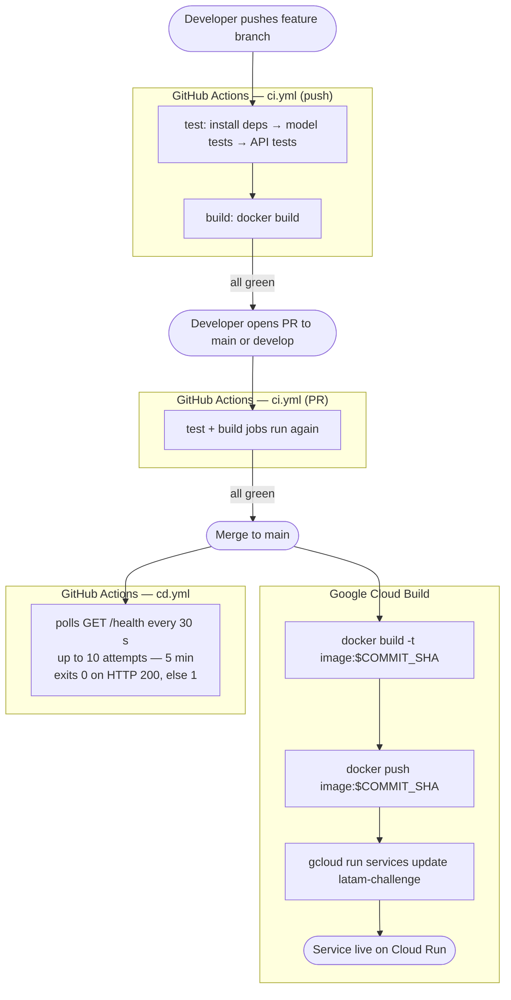
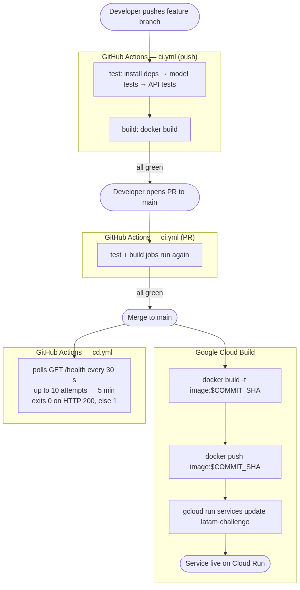

# Flight Delay Prediction — Technical Reference

## System Overview

This service predicts the probability of a flight delay (>15 minutes) at Santiago (SCL) airport. It exposes a REST API backed by a machine learning model trained on historical flight data.

On startup the API attempts to load a pre-trained model from `models/delay_model.pkl`. If that file is absent it trains from `data/data.csv` and persists the artifact.

---

## Model

### Algorithm choice: XGBoost Classifier

Two candidates were evaluated from the DS notebook: Logistic Regression and XGBoost. XGBoost was chosen because it produced meaningfully higher recall on the delayed class (class 1), which is the operationally relevant metric — missing a delayed flight is more costly than a false alarm.

### Feature engineering

Raw inputs are one-hot encoded. From the full encoding, the following **top-10 features** are kept (derived from airline, month, and flight type):

| Feature | Source column |
|---|---|
| `OPERA_Latin American Wings` | `OPERA` |
| `MES_7` | `MES` |
| `MES_10` | `MES` |
| `OPERA_Grupo LATAM` | `OPERA` |
| `MES_12` | `MES` |
| `TIPOVUELO_I` | `TIPOVUELO` |
| `MES_4` | `MES` |
| `MES_11` | `MES` |
| `OPERA_Sky Airline` | `OPERA` |
| `OPERA_Copa Air` | `OPERA` |

### Class imbalance

The dataset is imbalanced (~18% delayed flights). This is addressed via XGBoost's `scale_pos_weight` parameter, set to the ratio of negative to positive samples at training time.

### Hyperparameters

```python
XGBClassifier(
    learning_rate=0.01,
    random_state=1,
    scale_pos_weight=<computed from training data>
)
```

---

## API Reference

### `GET /health`

Health check endpoint.

**Response `200 OK`**
```json
{"status": "OK"}
```

---

### `POST /predict`

Predict delay probability for one or more flights.

**Request body**
```json
{
  "flights": [
    {
      "OPERA": "Grupo LATAM",
      "TIPOVUELO": "N",
      "MES": 3
    }
  ]
}
```

| Field | Type | Constraints |
|---|---|---|
| `OPERA` | `string` | Airline name (free text) |
| `TIPOVUELO` | `"N"` or `"I"` | National or International |
| `MES` | `integer` | 1–12 |

**Response `200 OK`**
```json
{"predict": [0]}
```

Each element in `predict` corresponds positionally to the input flight: `0` = no delay, `1` = delay expected.

**Response `400 Bad Request`** — validation error (invalid field value or missing field)

```json
{"detail": [...]}
```

**Response `500 Internal Server Error`** — prediction failure

---

## Project Structure

```
latam_challenge/
├── challenge/
│   ├── __init__.py          # Exports the FastAPI app instance
│   ├── api.py               # Endpoint definitions, Pydantic schemas, startup logic
│   └── model.py             # DelayModel class (preprocess / fit / predict)
├── data/
│   └── data.csv             # Historical SCL flight data
├── models/
│   └── delay_model.pkl      # Serialized trained model (joblib)
├── tests/
│   ├── model/test_model.py  # Preprocessing and fit/predict correctness
│   ├── api/test_api.py      # Endpoint integration tests
│   └── stress/api_stress.py # Locust load test scenarios
├── docs/
│   ├── challenge.md         # Implementation decisions and caveats
│   └── architecture.md      # This file
├── .github/workflows/       # GitHub Actions CI/CD pipelines
│   ├── ci.yml               # Test + Docker build gate (runs on PRs)
│   └── cd.yml               # Post-deploy smoke test (runs on merge to main)
├── Dockerfile
├── .dockerignore
├── Makefile
├── requirements.txt         # Runtime dependencies
├── requirements-test.txt    # Test tooling (pytest, locust, coverage)
└── requirements-dev.txt     # Exploration tooling (jupyter, matplotlib)
```

---

## Local Development

```bash
# Create and activate virtual environment
make venv
source .venv/bin/activate

# Install all dependencies
make install

# Start the API server (development)
uvicorn challenge.api:app --reload --port 8080
```

---

## Docker

```bash
# Build the image
docker build -t latam-delay-api .

# Run the container
docker run -p 8080:8080 latam-delay-api
```

The image bundles the training data and model artifact. If the model file is absent at runtime the container trains it on startup (fast, given the dataset size). See `docs/challenge.md` for the production-grade alternative.

---

## Testing

### Model tests

Validate preprocessing output shape, fit metrics (recall/F1 thresholds), and prediction output type.

```bash
make model-test
```

### API tests

Integration tests against the full FastAPI application using `TestClient`. Covers the happy path and validation error cases.

```bash
make api-test
```

### Stress test

Locust-based load test targeting the deployed API. Runs 100 concurrent users, 1 spawn/second, for 60 seconds.

```bash
make stress-test   # targets http://127.0.0.1:8000 by default
# To target a deployed URL, edit STRESS_URL in the Makefile (line 26)
```

---

## CI/CD

Two systems work together: **GitHub Actions** (test gating) and **Google Cloud Build** (build and deploy). They are independent pipelines that both fire on the same Git events but own different responsibilities.

### Flow diagram





---

### GitHub Actions — `.github/workflows/ci.yml`

Runs on every push to non-main branches and on every Pull Request targeting `main` or `develop`. No GCP credentials required.

```yaml
jobs:
  test:        # caches pip deps (keyed on requirements*.txt hash)
               # installs requirements.txt + requirements-test.txt
               # runs make model-test and make api-test
               # uploads reports/ as a downloadable artifact (even on failure)
  build:       # (needs: test) sets up Docker Buildx with GHA layer cache
               # runs docker/build-push-action (push: false) to validate the Dockerfile
               # catches image-build regressions before they reach main
```

**Purpose**: prevent broken code from reaching `main` or `develop`. If either job fails, GitHub marks the PR as failing and can be configured to block the merge.

---

### GitHub Actions — `.github/workflows/cd.yml`

Runs on every push to `main` (i.e., after a merge) and can be triggered manually via `workflow_dispatch`. No GCP credentials required — the Cloud Run service is publicly accessible.

```yaml
jobs:
  smoke-test:
    timeout-minutes: 10   # hard cap — prevents infinite hang if curl stalls
    steps:
      # step 1: wait 90 s to let Cloud Build get ahead before polling starts
      # step 2: polls GET /health every 30s, up to 10 attempts (5 min window)
      #         exits 0 on first HTTP 200, exits 1 if all attempts fail
```

**Purpose**: verify the deployment is healthy after Cloud Build finishes. The 90 s floor delay absorbs Cloud Build startup time (typically 2–4 min total build + deploy); the retry loop catches the remaining window.

---

### Google Cloud Build trigger

Configured via the GCP Console. Fires automatically when code is pushed to the `main` branch of the GitHub repository. Uses the `Dockerfile` in the repo root — no `cloudbuild.yaml` is required.

```yaml
# Trigger: push to ^main$ on github.com/<owner>/latam_challenge
description: Build and deploy to Cloud Run service latam-challenge on push to "^main$"

build:
  steps:
    - name: gcr.io/cloud-builders/docker
      id: Build
      args:
        - build
        - --no-cache
        - -t
        - $_AR_HOSTNAME/<GCP_PROJECT_ID>/$_AR_REPOSITORY/$REPO_NAME/$_SERVICE_NAME:$COMMIT_SHA
        - .
        - -f
        - Dockerfile

    - name: gcr.io/cloud-builders/docker
      id: Push
      args:
        - push
        - $_AR_HOSTNAME/<GCP_PROJECT_ID>/$_AR_REPOSITORY/$REPO_NAME/$_SERVICE_NAME:$COMMIT_SHA

    - name: gcr.io/google.com/cloudsdktool/cloud-sdk:slim
      id: Deploy
      entrypoint: gcloud
      args:
        - run
        - services
        - update
        - $_SERVICE_NAME
        - --platform=managed
        - --image=$_AR_HOSTNAME/<GCP_PROJECT_ID>/$_AR_REPOSITORY/$REPO_NAME/$_SERVICE_NAME:$COMMIT_SHA
        - --region=$_DEPLOY_REGION
        - --quiet

  substitutions:
    _AR_HOSTNAME: us-west1-docker.pkg.dev        # Artifact Registry host
    _AR_REPOSITORY: cloud-run-source-deploy      # registry repository name
    _SERVICE_NAME: latam-challenge               # Cloud Run service name
    _DEPLOY_REGION: us-west1
    # $COMMIT_SHA and $REPO_NAME are built-in Cloud Build variables
    # TODO: replace <GCP_PROJECT_ID> in the image paths above with your GCP project ID

  images:
    - $_AR_HOSTNAME/<GCP_PROJECT_ID>/$_AR_REPOSITORY/$REPO_NAME/$_SERVICE_NAME:$COMMIT_SHA

serviceAccount: <COMPUTE_SA>@developer.gserviceaccount.com  # TODO: replace <COMPUTE_SA> with your Compute Engine service account name
```

**Built-in substitution variables** (Cloud Build fills these automatically):

| Variable | Value |
|---|---|
| `$COMMIT_SHA` | Full SHA of the triggering commit |
| `$REPO_NAME` | Repository name (`latam_challenge`) |
| `$PROJECT_ID` | GCP project ID |
| `$BUILD_ID` | Unique ID of this Cloud Build run |
